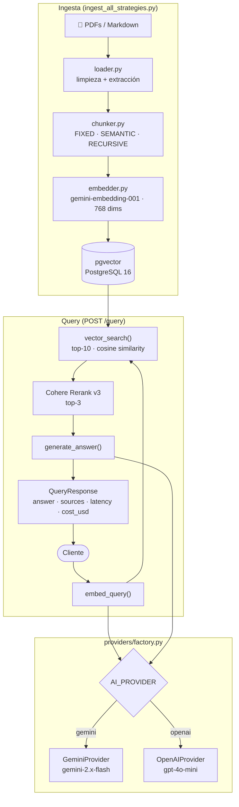

# SupportRAG


Sistema RAG para automatizar respuestas de soporte técnico sobre documentación privada. Construido con arquitectura multi-proveedor: cambia entre Google Gemini y OpenAI editando una sola variable de entorno.

---

## El problema que resuelve

Los agentes de soporte buscan manualmente en miles de páginas de documentación para responder cada ticket. SupportRAG indexa esa documentación y responde preguntas en lenguaje natural en menos de 3 segundos, citando las fuentes exactas de cada respuesta.

---

## Arquitectura

El diseño central es un **patrón Provider/Factory** que desacopla la lógica de negocio de los proveedores de IA. `query.py` y `embedder.py` nunca importan Gemini ni OpenAI directamente — solo conocen las clases abstractas `BaseLLMProvider` y `BaseEmbeddingProvider`. La `factory.py` resuelve el proveedor correcto en runtime según la variable `AI_PROVIDER` del entorno.



### Flujo de datos

```
POST /query
    │
    ├── embed_query()         factory → GeminiEmbeddingProvider
    │                         gemini-embedding-001 · 768 dims
    │
    ├── vector_search()       pgvector · cosine similarity · top-10
    │
    ├── rerank()              Cohere Rerank v3 · top-3
    │
    └── generate_answer()     factory → GeminiProvider / OpenAIProvider
```

### Estructura de providers

```
src/providers/
    factory.py              ← único punto de cambio de proveedor
    llm/
        base.py             ← BaseLLMProvider (ABC)
        gemini.py           ← GeminiProvider
        openai_llm.py       ← OpenAIProvider
    embeddings/
        base.py             ← BaseEmbeddingProvider (ABC)
        gemini.py           ← GeminiEmbeddingProvider
        openai_embedding.py ← OpenAIEmbeddingProvider
```

Agregar un proveedor nuevo (Anthropic, Mistral) requiere crear un archivo en `providers/llm/` y un `if` en `factory.py`. Ningún otro archivo cambia.

---

## Estrategias de Chunking (Sprint 2)

El sistema soporta tres estrategias de chunking configurables via `CHUNK_STRATEGY` en `.env`. Todas producen chunks de ~512 caracteres con overlap de 50.

| Estrategia | Descripción | Mejor para |
|---|---|---|
| `fixed` | Corta cada 512 caracteres con overlap | Documentos sin estructura clara |
| `semantic` | Agrupa por límites de oración | Texto corrido, FAQs |
| `recursive` | Respeta headers Markdown/PDF (`# ## ###`) | Documentación técnica estructurada |

### Comparativa de rendimiento

Benchmarks sobre el mismo conjunto de 6 preguntas contra el mismo documento, modelo `gemini-2.5-flash`:

| Estrategia | Latencia p50 | Latencia p95 | Score retrieval | Costo / 6 queries |
|---|---|---|---|---|
| `fixed` | 2 199 ms | 3 323 ms | 0.914 | $0.0004 |
| `semantic` | 2 509 ms | 2 701 ms | 0.914 | $0.0004 |
| `recursive` | 2 413 ms | 2 691 ms | 0.914 | $0.0004 |

> **Score** = similitud coseno promedio del vector search (0–1). Para faithfulness real, ver Sprint 3 (RAGAS eval suite).

`recursive` es el default: latencia consistente (p95 ≈ p50) y respeta la estructura de la documentación técnica.

Para indexar con las tres estrategias y comparar:

```bash
python scripts/ingest_all_strategies.py   # indexa fixed + semantic + recursive
python scripts/compare_chunking.py        # corre 6 preguntas por estrategia y guarda results/
```

---

## Stack

| Capa | Tecnología |
|------|-----------|
| API | FastAPI · Uvicorn |
| LLM | Google Gemini 2.x Flash / OpenAI GPT-4o-mini |
| Embeddings | Gemini gemini-embedding-001 (768 dims) / OpenAI text-embedding-3-small |
| Vector DB | PostgreSQL 16 + pgvector |
| Chunking | LangChain — 3 estrategias: fixed, semantic, recursive |
| Reranking | Cohere Rerank v3 |
| Evals | RAGAS + Langfuse (Sprint 3) |
| Caché | Redis |
| Infraestructura | Docker · Docker Compose |
| CI | GitHub Actions |

---

## Inicio rápido

**1. Clona y configura el entorno**

```bash
git clone https://github.com/saeseduardo/support-rag.git
cd support-rag
cp .env.example .env
```

Edita `.env` y agrega tu API key. Por defecto usa Gemini:

```env
AI_PROVIDER=gemini
GEMINI_API_KEY=AIza...        # obtén en ai.google.dev
LLM_MODEL=gemini-2.5-flash
CHUNK_STRATEGY=recursive      # fixed | semantic | recursive
```

Para usar OpenAI en su lugar:

```env
AI_PROVIDER=openai
OPENAI_API_KEY=sk-...
LLM_MODEL=gpt-4o-mini
EMBEDDING_MODEL=text-embedding-3-small
EMBEDDING_DIMENSIONS=1536
```

**2. Levanta los servicios**

```bash
docker compose up -d
```

**3. Indexa tus documentos**

Copia tus PDFs o archivos `.md` a la carpeta `/docs`, luego:

```bash
# Indexa con la estrategia configurada en .env
docker compose exec app python scripts/ingest.py

# O indexa con las 3 estrategias para comparar
docker compose exec app python scripts/ingest_all_strategies.py
```

El pipeline detecta automáticamente archivos nuevos o modificados (checksum MD5) y solo re-procesa los que cambiaron.

**4. Prueba el sistema**

```bash
curl -X POST http://localhost:8000/query \
  -H "Content-Type: application/json" \
  -d '{"query": "¿Cómo reseteo mi password?"}'
```

Respuesta:

```json
{
  "answer": "Para resetear tu password, ve a Configuración → Seguridad...",
  "sources": [
    { "source_file": "guia-usuario.pdf", "score": 0.91, "content": "..." }
  ],
  "tokens_used": 847,
  "cost_usd": 0.000093,
  "provider": "gemini-2.5-flash",
  "latency": { "embed_ms": 45, "search_ms": 18, "llm_ms": 890, "total_ms": 953 }
}
```

---

## Cambiar de proveedor

Editar una línea en `.env` y reiniciar:

```bash
# De Gemini a OpenAI
AI_PROVIDER=openai

# De OpenAI a Gemini
AI_PROVIDER=gemini
```

Ningún archivo de código cambia. El campo `provider` en la respuesta confirma cuál está activo.

> **Nota sobre dimensiones:** Gemini produce vectores de 768 dimensiones; OpenAI de 1536. Si cambias de proveedor en un proyecto ya con datos, actualiza `EMBEDDING_DIMENSIONS` en `.env` y re-indexa con `python scripts/ingest.py --force` para regenerar todos los embeddings.

---

## Decisiones técnicas

**pgvector sobre Pinecone o Chroma**
PostgreSQL ya está en la infraestructura de cualquier backend. Agregar la extensión pgvector añade búsqueda vectorial sin introducir otra base de datos que operar. El rendimiento es equivalente hasta ~1M de chunks. La columna `metadata JSONB` permite filtrar por fuente, fecha, sección o estrategia de chunking sin tablas adicionales.

**Chunking `recursive` como default**
Respeta la jerarquía de headers Markdown/PDF (`# > ## > ###`) antes de cortar por párrafo u oración. Esto mantiene la coherencia temática de cada chunk y reduce el ruido en el retrieval. El p95 de latencia es más consistente que `fixed` (2 691 ms vs 3 323 ms en benchmarks).

**Cohere Rerank después del vector search**
El vector search recupera top-10 por similitud coseno. Cohere Rerank re-puntúa esos 10 chunks con un modelo cross-encoder que entiende la relación semántica con la query, y entrega los top-3 al LLM. Reduce el contexto enviado al LLM en ~70% sin perder los chunks más relevantes.

**Gemini como proveedor default**
`gemini-embedding-001` es de alta calidad en 768 dims. `gemini-2.x-flash` tiene 1M de tokens de contexto vs 128K de `gpt-4o-mini`, lo que permite pasar más chunks sin truncar. El precio es un 33% menor que GPT-4o-mini para el mismo caso de uso.

**Factory con imports lazy**
Los imports de `GeminiProvider` y `OpenAIProvider` dentro de los `if` evitan que Python intente importar `google-generativeai` cuando `AI_PROVIDER=openai`, y viceversa. El proyecto funciona con solo una de las dos librerías instalada.

---

## Estructura del proyecto

```
support-rag/
├── .github/
│   └── workflows/
│       └── ci.yml            # CI: pytest con postgres+redis services
├── src/
│   ├── api/
│   │   ├── query.py          # POST /query
│   │   └── health.py         # GET /health
│   ├── ingestion/
│   │   ├── loader.py         # Lee y limpia PDFs y Markdown
│   │   ├── chunker.py        # 3 estrategias: fixed, semantic, recursive
│   │   ├── embedder.py       # Genera embeddings via factory
│   │   └── store.py          # Guarda en pgvector, ingesta incremental
│   ├── retrieval/
│   │   ├── searcher.py       # Cosine similarity con pgvector + filtros metadata
│   │   └── reranker.py       # Cohere Rerank v3
│   ├── providers/
│   │   ├── factory.py        # Único punto de cambio de proveedor
│   │   ├── llm/
│   │   │   ├── base.py       # BaseLLMProvider (ABC) + LLMResponse
│   │   │   ├── gemini.py     # GeminiProvider
│   │   │   └── openai_llm.py # OpenAIProvider
│   │   └── embeddings/
│   │       ├── base.py       # BaseEmbeddingProvider (ABC)
│   │       ├── gemini.py     # GeminiEmbeddingProvider
│   │       └── openai_embedding.py
│   ├── models/
│   │   ├── schemas.py        # Pydantic: QueryRequest, QueryResponse, SourceChunk
│   │   └── db.py             # init_db, tablas pgvector, get_db
│   ├── config.py             # Settings desde .env con Pydantic
│   └── main.py               # FastAPI app + routers
├── scripts/
│   ├── ingest.py                  # Ingesta con la estrategia del .env
│   ├── ingest_all_strategies.py   # Indexa fixed + semantic + recursive
│   ├── compare_chunking.py        # Benchmark de las 3 estrategias
│   └── manual_test.py             # Prueba con preguntas reales
├── tests/
│   ├── test_ingestion.py     # Limpieza de texto y chunking (unit)
│   ├── test_query.py         # Endpoints FastAPI (mocked)
│   └── test_sprint2.py       # Estrategias de chunking + reranker (unit)
├── docs/                     # Coloca aquí tus PDFs y .md
├── results/                  # chunking_comparison.json
├── docker-compose.yml        # PostgreSQL 16 + pgvector + Redis
├── Dockerfile                # Multi-stage, imagen < 200MB
├── requirements.txt
└── .env.example
```

---

## Tests

```bash
# Dentro del container
docker compose exec app python -m pytest tests/ -v

# En CI (GitHub Actions) corre automáticamente en cada push/PR
```

Los tests de `test_query.py` mockean el vector search, reranker y LLM — no consumen API keys. `test_sprint2.py` cubre las tres estrategias de chunking y el fallback del reranker sin Cohere key.

---
