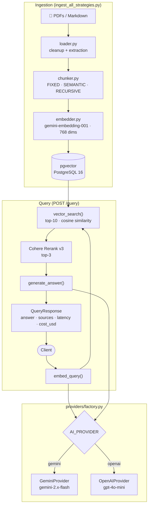

# SupportRAG


RAG system to automate technical support answers over private documentation. Built with a multi-provider architecture: switch between Google Gemini and OpenAI by editing a single environment variable.

---

## The problem it solves

Support agents manually search through thousands of pages of documentation to answer each ticket. SupportRAG indexes that documentation and answers natural-language questions in under 3 seconds, citing the exact sources for each answer.

---

## Architecture

The core design is a **Provider/Factory pattern** that decouples business logic from AI providers. `query.py` and `embedder.py` never import Gemini or OpenAI directly — they only know the abstract classes `BaseLLMProvider` and `BaseEmbeddingProvider`. `factory.py` resolves the correct provider at runtime based on the `AI_PROVIDER` environment variable.



### Data flow

```
POST /query
    │
    ├── embed_query()         factory → GeminiEmbeddingProvider
    │                         gemini-embedding-001 · 768 dims
    │
    ├── vector_search()       pgvector · cosine similarity · top-10
    │
    ├── rerank()              Cohere Rerank v3 · top-3
    │
    └── generate_answer()     factory → GeminiProvider / OpenAIProvider
```

### Provider structure

```
src/providers/
    factory.py              ← single point of provider change
    llm/
        base.py             ← BaseLLMProvider (ABC)
        gemini.py           ← GeminiProvider
        openai_llm.py       ← OpenAIProvider
    embeddings/
        base.py             ← BaseEmbeddingProvider (ABC)
        gemini.py           ← GeminiEmbeddingProvider
        openai_embedding.py ← OpenAIEmbeddingProvider
```

Adding a new provider (Anthropic, Mistral) requires creating a file in `providers/llm/` and an `if` in `factory.py`. No other file changes.

---

## Chunking Strategies

The system supports three configurable chunking strategies via `CHUNK_STRATEGY` in `.env`. All produce chunks of ~512 characters with 50-character overlap.

| Strategy | Description | Best for |
|---|---|---|
| `fixed` | Cuts every 512 characters with overlap | Documents without clear structure |
| `semantic` | Groups by sentence boundaries | Running text, FAQs |
| `recursive` | Respects Markdown/PDF headers (`# ## ###`) | Structured technical documentation |

### Performance comparison

Benchmarks on the same set of 6 questions against the same document, model `gemini-2.5-flash`:

| Strategy | Latency p50 | Latency p95 | Retrieval score | Cost / 6 queries |
|---|---|---|---|---|
| `fixed` | 2,199 ms | 3,323 ms | 0.914 | $0.0004 |
| `semantic` | 2,509 ms | 2,701 ms | 0.914 | $0.0004 |
| `recursive` | 2,413 ms | 2,691 ms | 0.914 | $0.0004 |

> **Score** = average cosine similarity of the vector search (0–1). For real faithfulness, see Sprint 3 (RAGAS eval suite).

`recursive` is the default: consistent latency (p95 ≈ p50) and it respects the structure of the technical documentation.

To index with all three strategies and compare:

```bash
python scripts/ingest_all_strategies.py   # indexes fixed + semantic + recursive
python scripts/compare_chunking.py        # runs 6 questions per strategy and saves results/
```

---

## Stack

| Layer | Technology |
|------|-----------|
| API | FastAPI · Uvicorn |
| LLM | Google Gemini 2.x Flash / OpenAI GPT-4o-mini |
| Embeddings | Gemini gemini-embedding-001 (768 dims) / OpenAI text-embedding-3-small |
| Vector DB | PostgreSQL 16 + pgvector |
| Chunking | LangChain — 3 strategies: fixed, semantic, recursive |
| Reranking | Cohere Rerank v3 |
| Evals | RAGAS + Langfuse (Sprint 3) |
| Cache | Redis |
| Infrastructure | Docker · Docker Compose |
| CI | GitHub Actions |

---

## Quick start

**1. Clone and set up the environment**

```bash
git clone https://github.com/saeseduardo/support-rag.git
cd support-rag
cp .env.example .env
```

Edit `.env` and add your API key. Uses Gemini by default:

```env
AI_PROVIDER=gemini
GEMINI_API_KEY=AIza...        # get it at ai.google.dev
LLM_MODEL=gemini-2.5-flash
CHUNK_STRATEGY=recursive      # fixed | semantic | recursive
```

To use OpenAI instead:

```env
AI_PROVIDER=openai
OPENAI_API_KEY=sk-...
LLM_MODEL=gpt-4o-mini
EMBEDDING_MODEL=text-embedding-3-small
EMBEDDING_DIMENSIONS=1536
```

**2. Start the services**

```bash
docker compose up -d
```

**3. Index your documents**

Copy your PDFs or `.md` files into the `/docs` folder, then:

```bash
# Index with the strategy configured in .env
docker compose exec app python scripts/ingest.py

# Or index with all 3 strategies to compare
docker compose exec app python scripts/ingest_all_strategies.py
```

The pipeline automatically detects new or modified files (MD5 checksum) and only re-processes the ones that changed.

**4. Test the system**

```bash
curl -X POST http://localhost:8000/query \
  -H "Content-Type: application/json" \
  -d '{"query": "How do I reset my password?"}'
```

Response:

```json
{
  "answer": "To reset your password, go to Settings → Security...",
  "sources": [
    { "source_file": "user-guide.pdf", "score": 0.91, "content": "..." }
  ],
  "tokens_used": 847,
  "cost_usd": 0.000093,
  "provider": "gemini-2.5-flash",
  "latency": { "embed_ms": 45, "search_ms": 18, "llm_ms": 890, "total_ms": 953 }
}
```

---

## Switching providers

Edit one line in `.env` and restart:

```bash
# From Gemini to OpenAI
AI_PROVIDER=openai

# From OpenAI to Gemini
AI_PROVIDER=gemini
```

No code file changes. The `provider` field in the response confirms which one is active.

> **Note on dimensions:** Gemini produces 768-dimensional vectors; OpenAI produces 1536. If you switch providers on a project that already has data, update `EMBEDDING_DIMENSIONS` in `.env` and re-index with `python scripts/ingest.py --force` to regenerate all embeddings.

---

## Technical decisions

**pgvector over Pinecone or Chroma**
PostgreSQL is already part of any backend's infrastructure. Adding the pgvector extension adds vector search without introducing another database to operate. Performance is equivalent up to ~1M chunks. The `metadata JSONB` column allows filtering by source, date, section, or chunking strategy without additional tables.

**`recursive` chunking as default**
Respects the Markdown/PDF header hierarchy (`# > ## > ###`) before cutting by paragraph or sentence. This keeps each chunk thematically coherent and reduces retrieval noise. The p95 latency is more consistent than `fixed` (2,691 ms vs 3,323 ms in benchmarks).

**Cohere Rerank after vector search**
Vector search retrieves the top-10 by cosine similarity. Cohere Rerank re-scores those 10 chunks with a cross-encoder model that understands the semantic relationship with the query, and delivers the top-3 to the LLM. This reduces the context sent to the LLM by ~70% without losing the most relevant chunks.

**Gemini as the default provider**
`gemini-embedding-001` is high quality at 768 dims. `gemini-2.x-flash` has a 1M-token context window vs 128K for `gpt-4o-mini`, allowing more chunks to be passed without truncation. The price is 33% lower than GPT-4o-mini for the same use case.

**Factory with lazy imports**
The `GeminiProvider` and `OpenAIProvider` imports inside the `if` blocks prevent Python from trying to import `google-generativeai` when `AI_PROVIDER=openai`, and vice versa. The project works with only one of the two libraries installed.

---

## Project structure

```
support-rag/
├── .github/
│   └── workflows/
│       └── ci.yml            # CI: pytest with postgres+redis services
├── src/
│   ├── api/
│   │   ├── query.py          # POST /query
│   │   └── health.py         # GET /health
│   ├── ingestion/
│   │   ├── loader.py         # Reads and cleans PDFs and Markdown
│   │   ├── chunker.py        # 3 strategies: fixed, semantic, recursive
│   │   ├── embedder.py       # Generates embeddings via factory
│   │   └── store.py          # Saves to pgvector, incremental ingestion
│   ├── retrieval/
│   │   ├── searcher.py       # Cosine similarity with pgvector + metadata filters
│   │   └── reranker.py       # Cohere Rerank v3
│   ├── providers/
│   │   ├── factory.py        # Single point of provider change
│   │   ├── llm/
│   │   │   ├── base.py       # BaseLLMProvider (ABC) + LLMResponse
│   │   │   ├── gemini.py     # GeminiProvider
│   │   │   └── openai_llm.py # OpenAIProvider
│   │   └── embeddings/
│   │       ├── base.py       # BaseEmbeddingProvider (ABC)
│   │       ├── gemini.py     # GeminiEmbeddingProvider
│   │       └── openai_embedding.py
│   ├── models/
│   │   ├── schemas.py        # Pydantic: QueryRequest, QueryResponse, SourceChunk
│   │   └── db.py             # init_db, pgvector tables, get_db
│   ├── config.py             # Settings from .env with Pydantic
│   └── main.py               # FastAPI app + routers
├── scripts/
│   ├── ingest.py                  # Ingestion with the strategy from .env
│   ├── ingest_all_strategies.py   # Indexes fixed + semantic + recursive
│   ├── compare_chunking.py        # Benchmark of the 3 strategies
│   └── manual_test.py             # Test with real questions
├── tests/
│   ├── test_ingestion.py     # Text cleanup and chunking (unit)
│   ├── test_query.py         # FastAPI endpoints (mocked)
│   └── test_sprint2.py       # Chunking strategies + reranker (unit)
├── docs/                     # Place your PDFs and .md files here
├── results/                  # chunking_comparison.json
├── docker-compose.yml        # PostgreSQL 16 + pgvector + Redis
├── Dockerfile                # Multi-stage, image < 200MB
├── requirements.txt
└── .env.example
```

---

## Tests

```bash
# Inside the container
docker compose exec app python -m pytest tests/ -v

# In CI (GitHub Actions) runs automatically on every push/PR
```

The `test_query.py` tests mock the vector search, reranker, and LLM — no API keys are consumed. `test_sprint2.py` covers the three chunking strategies and the reranker fallback without a Cohere key.

---
